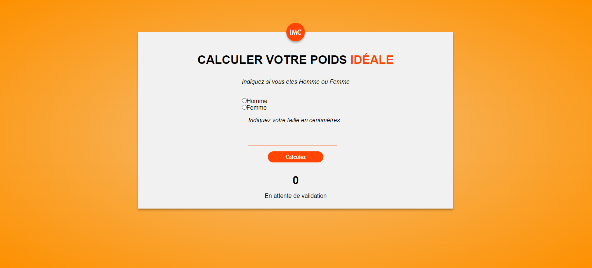
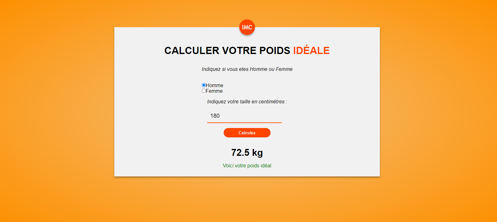
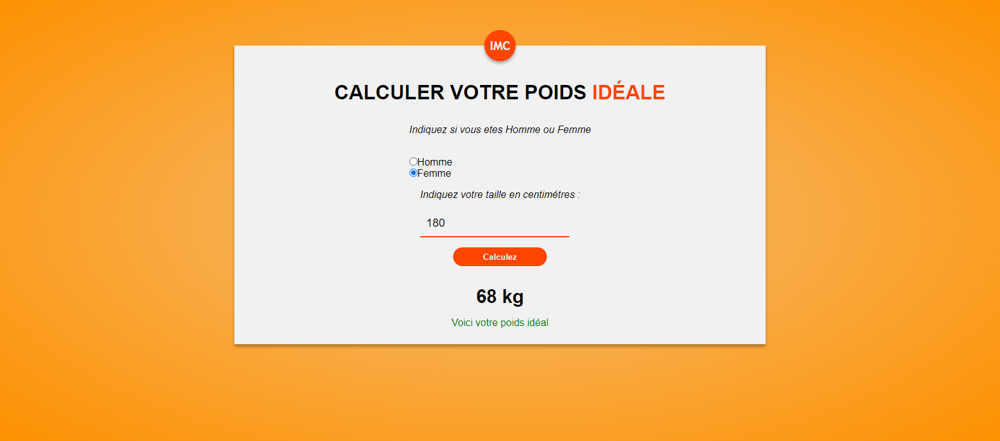

# Ideal Weight Calculator

This project is a simple ideal weight calculator based on the user's height and gender. Users can enter their height and select their gender using radio buttons. After submitting the form, the ideal weight is calculated and displayed.

## Operation

### How to Use

1. Clone this repository to your local machine.
2. Open the `index.html` file in your web browser.

### Entering Data

- **Height:** Enter your height in centimeters in the input field.
- **Gender:** Select your gender by checking the corresponding button (Male or Female).

### Ideal Weight Calculation

Once the data is entered, click the "Submit" button. The ideal weight will be calculated based on the specified formula for each gender.

### Results

The result of the ideal weight calculation will be displayed with colored information based on the validity of the entered data.

- In case of an error or invalid data, an error message will be displayed in red.
- In the case of valid data, the ideal weight will be displayed in green with an informative message.

## Development

The source code of this project is written in HTML, CSS, and JavaScript. JavaScript is used to manipulate the DOM and perform the ideal weight calculation based on user input.

## License

This project is licensed under the MIT License - see the [LICENSE](GPL) file for more details.

---
**Author: Richard GADJENOU**
